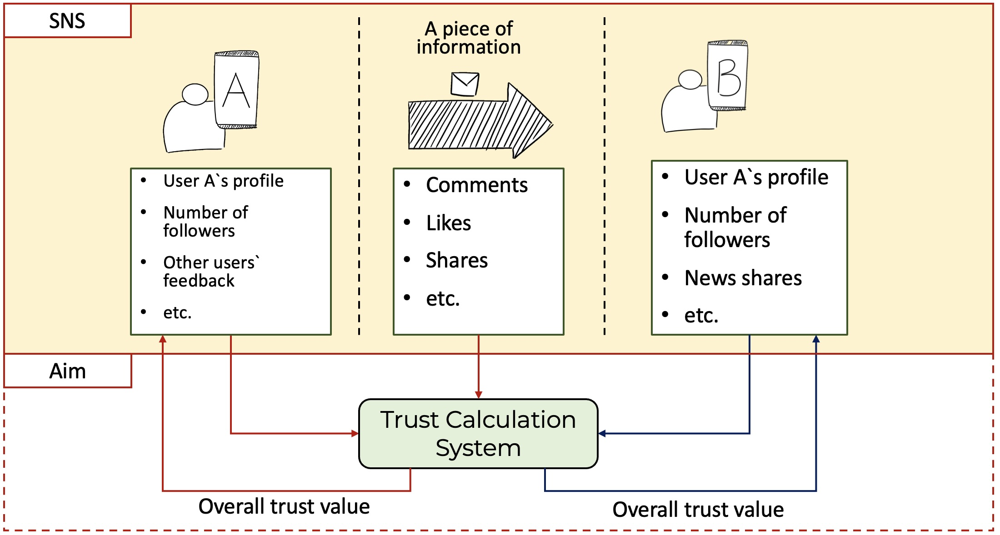

# Agent-based Simulation of Fake News Dissemination: The Role of Trust Assessment and Big Five Personality Traits on News Spreading
by Radifan Fitrach Muhammad, Shoji Kasahara.

Presentation Slides: ([pdf](conference/presentation.pdf)).

>We proposed Users' trustworthiness evaluation "trust model" that encompasses identity-based, behavior-based, relation-based, feedback factors, and information-based trust. Additionally, the Big-Five personality traits are taken into account in this model.
We provided our proposed scheme as follows:
>
